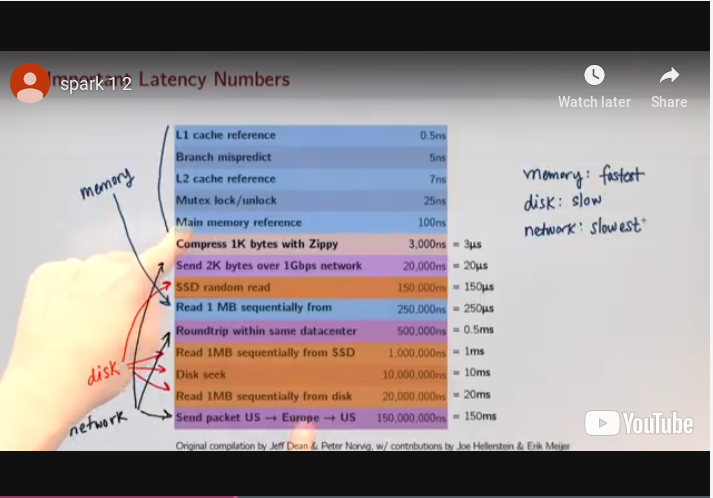
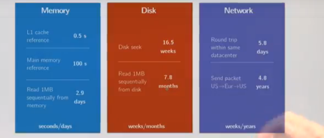
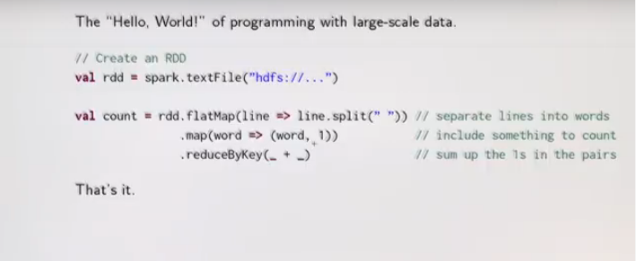
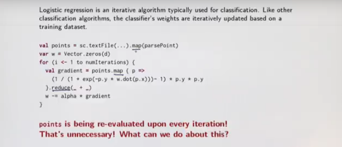
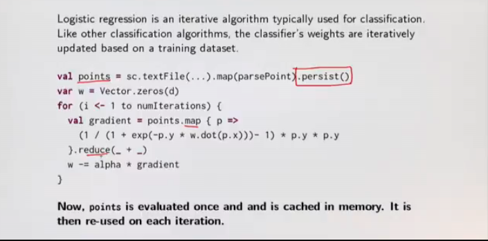

# Data Parallelism

Latency will always something we need to be aware of. As opposed to the shared memory model

## Latency

Distribution introduces important concerns beyond what we had to worry about when dealing with parallelism in the shared memory case:

- **Partial failure** : crash failures of a subset of the machines involved in a distributed computation.
- **Latency** : certain operations have a much higher latency than other operations due to network communications.



For more references on the latency times between memory models please refer to the [Humanised Latency Numbers gist.](https://gist.github.com/hellerbarde/2843375)

## Spark's Latency Model



Spark uses a different model of latency instead of hadoop.

It achieves this by using ideas from functional programming.

**Idea**: Keep all data immutable and in-memory. All operations on data are just functional transformations, like regular Scala Collections. Fault tolerance is achieved by replaying functional transformations over original dataset.

Result: Spark has been shown to be 100x more performant than Hadoop, while adding even more expressive APIs.

Spark aggressively minimises network traffic and tries to keep as much computations in memory. Whereas hadoop focuses on reading/writing to disk.

**Latency cannot be masked completely; it will be an important aspect that also impacts the programming model**

---

# RDDs, Spark Distributed Collection

They seem a lot like immutable sequential or parallel Scala collections



They are monads so flatMap filter, map, etc. Most operations on RDDs, like Scala's immutable List, and Scala's parallel collections, are higher-order functions.

Using RDDs is similar to Scala's parallel collections API.

To create an RDD, there are 2 options:

* Tranforming an existing RDD
* From a SparkContext (older version) or SparkSession (new version) objects

The SparkSession can be though of as your handle to the Spark cluste. It represents the connection between the Spark Cluster and your running application. It defines a handful of methods which can be used to create and populate a new RDD:

* parallelise: convert a local Scala collection to an RDD.
* textfile: read a text file from HDFS or a local file system and return an RDD of String.

---

# RDDs, Transformations and Actions

Recall transformers and accessors from Scala sequential and parallel collections.

_Transformers_. Return new collections as results (Not single values.)
Examples: map, filter, flatMap, groupBy.

_Accessors_: Return single values as results (Not collections.)
Examples: reduce, fold, aggregate.

In Spark RDDs:

_Transformations_. Return new RDDs as results.
_**They are lazy, their result RDD is not immediately computed.**_

_Actions_. Compute a result based on an RDD, and either returned or svaed to an external storage system (e.g HDFS)
_**They are eager, their result is immediately computed.**_

Laziness/eagerness is how we can limit network communication using the programming model.

You create a SparkSession once in a project.

**Common Lazy operations**:

* map
* flatMap
* filter
* distinct

_They all return RDD[B]_

**Common Eager Actions**:

* collect Array[T]
* count  Long
* take Array[T]
* reduce A
* foreach Unit

Spark computes RDDs the first time they are used in action.

This helps when processing large amounts of data.

Example :

```javascript
val lastYearsLogs: RDD[String] = ...
val firstLogsWithErrors = loastYearsLogs.filter(_.contains("Error")).take(10)
```

The execution of filter is deferred until the take action is applied.

Spark achieves this by analysing and optimising the chain of operations before executing it.

Spark will not compute intermediate RDDs. Instead, as soon as 10 elements of the filtered RDD have been computed, `firstLogsWithErrors` is done. At this point Spark stops working. saving time and space computing elements of the unused result of filter.

_Transformations on Two RDDs_ (It's also lazy as we're returning RDD[T])

RDDs also support set-like operations, like union and intersection. Two-RDD transformations is where we combine 2 RDDs into one RDD

* union RDD[T]
* intersection RDD[T]
* subtract RDD[T]
* Cartesian RDD[T]


RDDs also contain other important actions unrelated to regular Scala collections, but which are useful when dealing distributed data.

* takeSample Array[T]
* takeOrdered  Array[T]
* saveAsTextFile Unit
* saveAsSequenceFile Unit

---

# Evaluation in Spark : Unlike Scala Collections!

_**Always try to minimise the number of evaluations.**_

By default, RDDs are recomputed each time you run an action on them. This can be expensive (in time) if you need to use a dataset more than once

Spark allows you to control what is cached in memory

To tell Spark to cache an RDD in memory, simply call persist() or cache() on it

For example:
```javascript
val lastYearsLogs: RDD[String] = ...
val logsWithErrors = lastYearsLogs.filter(_.contains("ERROR")).persist()
val firsLogsWithErrors = logsWithErrors.take(10)
val numErrors = logsWithErrors.count() // faster
```

Here we cache `logsWithErrors` in memory.

After `firstLogsWithErrors` is computed, Spark will store the contents of `logsWithErrors` for faster access in future operations if we would like to reuse it.

There are many ways to configure how your data is persisted.

Possible ways to persist your data are:
- in memory as regular java objects (default for cache())
- on disk as regular java objects
- in memory as serializd java objects (more compact)
- on disk as serialised java objects (more compact)
- both in memory and on disk (spill over to disk to avoid re-computation)

`cache`

Shorthand for using default storage level, which is in memory only as regular Java objects.

`persist`

Persistence can be customised with this method. Pass the storage level you'd like as a parameter to persist.

_**Examples of when to use caching or Persistence**_





## Key take away  with RDDs

Despite similar-looking API to Scala Collections the deferred semantics of Spark's RDDs are very unlike Scala collections

Due to:
* the lazy semantics of RDD transformations operations
* and users' implicit reflex to assume collections are eagerly evaluated

One of the most common performance bottlenecks of newcomers to spark arises from unknowingly re-evaluating several transformations when caching could be used.

**Don't make this mistake in your programming assignments.**

While many users struggle with the lazy semantics of RDDs at first, it's helpful to remember the ways in which these semantics are helpful in
the face of large-scale distributed computing

```javascript
val lastYearsLogs: RDD[String] = ...
val logsWithErrors = lastYearsLogs.map(_.lowercase).filter(_.contains("ERROR")).count()
```

Lazy evaluation of these transformations allows spark to stage computations. This is spark can make important optimisations to the chain of operations before execution.

For example, after calling map and filter, Spark knows that it can avoid doing multiple passes through the data. That is, spark can traverse through the RDD once, computing the result of map and filter in this single pass, before returning
the resulting count.

---

# Cluster Topology Matters

 Assume we have an RDD populated wiht Person objects:

 ```javascript
 case class Person(name: String, age: Int)
 ```

 What does the following code snippet do?

 ```javascript
 val people: RDD[Person] = ...
 people.foreach(println)
 ```

```
For each people object in the person RDD we print it out on every
node in the cluster. But not on the driver
```

## How Spark Jobs are Executed

* Spark operates on a master slave model
* The master is called the driver
* The slaves are the worker nodes
* We write our program from the perspective of the driver program
* The `SparkContext` is our handle on the spark cluster
* The `Executors` perform the actual computations
* The driver and workers are managed by cluster managers, who manage the resources across the network and scheduling of Jobs

## Moral of the story

To make effective use of RDDs you have to understand a little bit about how spark Spark works under the hood.

Due an API which mixed eager/lazy, it's not always immediately obvious upon first glance on what part of the cluster a line of code might run on.
**It's on you to know where your code is executing!**

_Even though RDDs look like regular Scala collections upon first glance, unlike collections, RDDs require you to have a good grasp of the underlying infrastructure they are running on._
