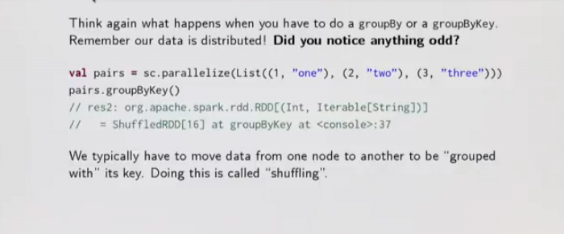
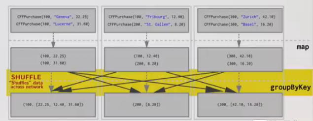
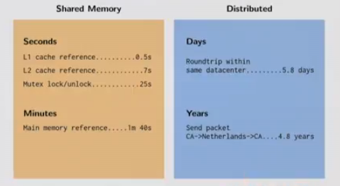
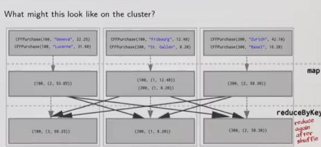
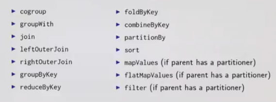
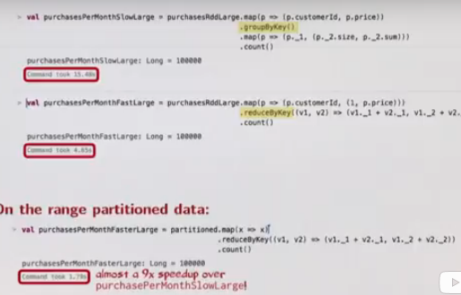

# Partitioning and Shuffling
---
## Shuffling: What it is and why it's important



We typically have to move data from one node to another to be "grouped with" it's key. Doing this is called "shuffling".

**Shuffles Happen**

Shuffles can be an enormous hit to performance because it means that Spark must send data from one node to another. Why? **Latency!!**

Let's start with an example. Given:

```
case class CFFPurchase(customerId: Int, destination: String, price: Double)
```

Assume we have an RDD of the purchases that users of the Swiss train compnay's the CFF's, mobile app have made in the past month.

```
val purchasesRdd: RDD[CFFPurchase] = sc.textFile(..)
```

**Goal: calculate how many trips, and how much money was spent by each customer over the course of the month?**

```
val purchasesPerMonth =
  purchasesRdd.map(p => (p.customerId, p.price)) // Pair RDD
              .groupByKey() // groupByKey returns RDD[K, Iterable[V]]
              .map(p => (p._1, (p._2.size, p._2.sum)))
              .collect()

val purchases = List(CFFPurchase(100, "Geneva", 22.25),
                    CFFPurchase(300, "Zurich", 42.10),
                    CFFPurchase(100, "Fribourg", 42.10),
                    CFFPurchase(200, "Zurich", 42.10),
                    CFFPurchase(100, "Zurich", 42.10),
                    CFFPurchase(300, "Zurich", 42.10),
                    )
```
What might the cluster look like with this data distributed over it?

Starting with purchasesRDD:




**We don't want to be sending all of our data over the network if it's not absolutely required. Too much network communication kills performance.**

Is there a way to not send all the pairs over the network?

Perhaps we can reduce before we shuffle. This could greatly reduce the amount of data we have to send over the network.

### Grouping and Reducing

We can use reduceByKey.

Conceptually, reduceByKey can be thought of as a combination of first groupByKey and then reducing on all the values grouped per key. It's more efficient though, than using each seprately. We'll see how in the following example.

**Signature**
```
def reduceByKey(func: (V, V) => V): RDD[(K, V)]
```

```
val purchasesPerMonth =
  purchasesRdd.map(p => (p.customerId, (1, p.price))) // Pair RDD
  .reduceByKey((acc, curr) => (acc._1 + curr._1, acc._2 + curr._2))
  .collect()
```



**What are the benifits of this approach?**

By reducing the dataset first, the amount of data sent over the network during the shuffling is greatly reduced.

This can result in non-trivial gains in performance!

 Grouping all the key-value pairs with the same key requires collecting all key-value pairs with the same key on the same machine.

 __But how does Spark know which key to put on which machine?__

* By default, Spark uses hash partitioning to determine which key-value pair should be sent to which machine.
---
## Partitioning

Proper partitioning can save us a lot of time in our computations.

In the last section, we were looking at an example involving groupByKey, before we discovered that this operation causes data to be shuffled over the network.

> Grouping all values of key-value pairs with the same key requires collecting all key-values pairs with the same key on the same machine.

We concluded in the last session asking ourselves,
**But how does Spark know which key to put on which machine?**

**Before we try to optimise that example any further, let's first take a quick detour into what partitioning is...**

### Partitions

The data within RDD is split into several partitions:

**Properties of partitions**

* Partitions never span multiple machines, i.e, tuples in the same partition are guaranteed to be on the same machine.
* Each machine in the cluster contains one or more partitions.
* The number of partitions to use is configurable. By default, it equals the total number of cores on all executor nodes.

**Two kinds of partitioning available in Spark:**

* Hash partitioning
* Range partitioning

*Customizing a partitioning is only possible on Pair RDDS.*

### Hash Partitioning

Back to our example. Given a Pair RDD that should be grouped:

```
val purchasePerCust =
  purchasesRDD.map(p => (p.customerId, p.price))
  .groupByKey()
```

groupByKey first computes per tuple (k, v) its partition p:
```
p = k.hashCode() % numPartitions
```
Then all tuples in the same partition p are sent to the machine hosting p.

**Intuition: hash partitioning attempts to spread data evenly across partitions based on the key.**


### Range Partitioning

Pair RDDs may contain keys that have an ordering defined
* Examples: Int, Char, String, ...

For such RDDs, range partitioning may be more efficient.
Using a range partitioner, keys are partitioned according to:
1. an ordering for keys
2. a set of sorted ranges of keys
Property: tuples with keys in the same range appear on the same machine.

### Hash Partitioning: Example

Consider a Pair RDD, with keys [8, 96, 240, 400, 401, 800], and a desired number of partitions of 4.

Furthermore, supposes that hashCode() is the identity (n.hashCode() == n).

In this case, hash partitioning distributes the keys as follows among the partitions:
* partition 0: [8, 96, 240, 400, 800]
* partition 1: [401]
* partition 2: []
* partition 3: []

The result is a very unbalanced distribution which hurts performance.

### Range partitioning: Example
Using range partitioning the distribution can be imporved significantly:
* Assumptions: (a) keys non-negative, (b) 800 is biggest key in the RDD.
*  Set of ranges: [1, 200], [201, 400], [401, 600], [601, 800]

In this case, range partitioing distributes the keys as follows among the partitions:
* partition 0: [8, 96]
* partition 1: [240, 400]
* partition 2: [401]
* partition 3: [800]

The resulting partitioning is much more balanced.

**How do we set a partitioning for our data?**
There are two ways to create RDDs with specific partitionings:
1. Call partitionBy on an RDD, providing an explicit Partitioner.
2. Using transformations that return RDDs with specific partitioners.

### partitionBy

Invoking partitionBy creates an RDD with a specific partitioner.

Example:

```
val paris = purchasesRDD.map(p => (p.customerId, p.price))

val tunedPartitioner = new RangePartitioner(8, pairs)
val partitioned = pairs.partitionBy(tunedPartitioner).persist()

```

Create a RangePartitioner requires:
1. Specifying the desired number of partitions.
2. Providing a Pair RDD with ordered keys. This RDD is sampled to create a suitable set of sorted ranges.

**Important: the results of partitionBy should be persisted. Otherwise, the partitioning is repeatedly applied (involving shuffling!) each time the partitioned RDD is used.**

### Partitioning Data Using Transformations

**Partitioner form parent RDD:**

Pair RDDs that are the result of a transformation on a partitioned Pair RDD typically is configured to use the hash partitioner that was used to construct it.

**Automatically-set partitioners:**

Some operations on RDDs automatically result in an RDD with a known partitioner - for when it makes sense.

For example, by default, when using sortByKeys, a RangePartitioner is used. Further, the default partitioner when using groupByKey, is a HashPartitioner, as we saw earlier.

### Partitioning Data Using Transformations
Operations on Pair RDDs that hold to (and propagate) a partitioner.



**All other operations will produce a result with a partitioner**

*Note the absence of map and flatMap*

**Why?**

Consider the map transformations. Given that we have a hash partitioned Pair RDD, why it make sense for map to lose the partitioner in its result RDD?
Because it's possible for map to change the key. EG..
```
rdd.map((k: String, v: Int) -> ("doh!", v))
```
In this case, if the map transformation preserved the partitioner in the result RDD, it no longer make sense, as now the keys are all different.

**Hence mapValues. It enables us to still do map transformations without changing the keys, thereby preserving the partitioner**

---

## Optimising with Partitions

We saw in the last session that Spark makes  a few kinds of partitioners available out of the box to users:

* hash partitioners
* range partitioners

We also learned what kinds of operations may introduce new partitioners, or which may discard custom partitioners

However, we haven't covered why someone would want to repartition their data.

**Partitioning can bring substantial performance gains, especially in the face of shuffles.**

Using range partitioners we can optimise our earlier use of reduceByKey so that it does not involve any shuffling over the network at all!

```
val pairs = purchasesRdd.map(p => (p.customerId, p.price))
val tunedPartitioner = new RangePartitioner(8, pairs) // 8 might make sense for the cluster

val partitioned = pairs.partitionBy(tunedPartitioner).persist()

val purchasePerCust = partitioned.map(p => (p._1, (1, p._2)))

val purchasesPerMonth = purchasePerCust
  .reduceByKey((v1, v2) => (v1._1 + v2._1, v1._2 + v2._2))
  .collect()
```



### Partitioning Data: partitionBy Example

Consider an application that keeps a large table of user information in memory:
* userData - BIG, containing (UserId, UserInfo) pairs, where UserInfo contains a list of topics the user is subscribed to.

The application periodically combines this big table with a smaller file representing events that happened in the past 5 minutes.

* events - small, containing (UserId, LinkInfo) pairs for users who have clocked a link on a website in those 5 minutes:

For example, we may wish to count how many users visited a link that was not to one of their subscribed topics. We can perfrom this combination with Spark's join operation, which can be used to group the UserInfo and LinkedInfo pairs for each UserUd by Key.


```
val sc = new SparkContext(..)
val userDate = sc.sequenceFile[UserId, UserInfor]("hdfs://...").persist()

def processNewLogs(logFileName: String) {
  val events = sc.sequenceFile[UserId, LinkInfo](logFileName)
  val joined = userDate.join(events) // RDD of (UserId, (UserInfo, LinkInfo))
  val offTopicVisits = joined.filter {
    cases (userId, (userInfo, linkInfo)) => // Expand the tuple
      !userInfo.topics.contains(linkInfo.topic)
  }.count()
  println("Number of visits to non-subscribed topics " + offTopicVisits)
}
```

**Is this OK?**
