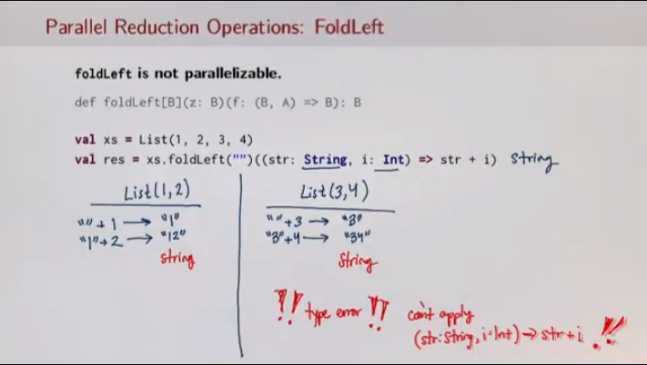
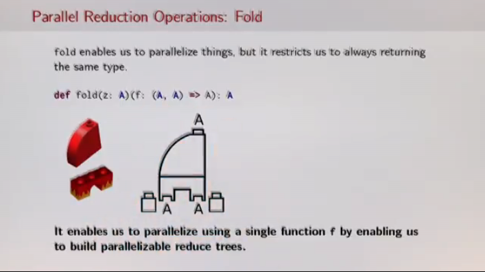
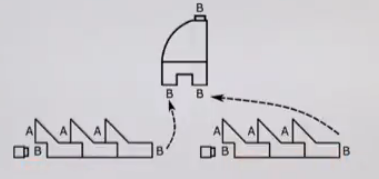
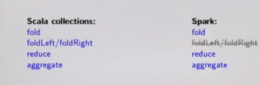
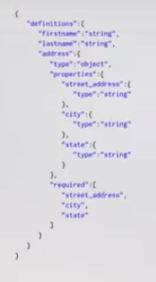

# Reduction Operations & Distributed Key-Value Pairs
---

## Reduction Operations

**How are reduce like actions distributed in spark?**

**Reduction Operations:** Walk through a collections and combine neighbouring elements of the collection together to produce a single combined result.

**Example:**
```Scala
case class Taco(kind: String, price: Double):

val tacoOrder =
  List(
    Taco("Carnitas", 2.25),
    Taco("Corn", 3.00),
    Taco("Chicken", 2.00)
    )

val cost = tacoOrder foldLeft (0.0) ((sum, taco) => sum + taco.price)
```
### Parallel Reduction operations

#### FoldLeft & Fold
**Recall what we learned in the course Parallel Programming course about `foldLeft` and `fold`**.

_Which of these two were parallelisable?_ **A:** `fold`, is because you're not concerned with the order of the reduction. Whereas, `foldLeft` applies a binary operator to a start value and all elements of this collection or operator, going left to right.





#### Aggregate

Similar to fold and fold left

`aggregate[B](z: => B)(seqop: (A, B) => B, combop: (B,B) => B): B`

`aggregate` is said to be general because it gets you the best of both worlds.

**Properties of aggregate**
1. Parallelisable
2. Possible to change the return type



Aggregate lets you to still do sequential-style folds in _chunks_ which change the result type. Additionally requiring the `combop` function enables building one of these nice reduce trees that we saw is possible with fold to combine these _chuncks_ in parallel.

#### RDD reduction operations



Spark doesn't even give you the option to use `foldLeft/foldRight`. Which means that if you have to change the return type of you reduction operation, your only choice is to use aggregate.

_**Question:** Why not still have a serial foldLeft/foldRight on Spark?_

_Doing things serially across a cluster is actually difficult. Lots of synchronisation. Doesn't make a lot of sense._

In Spark, `aggregate` is a more desirable reduction operator a majority of the time. Why do you think that's the case?

As you will realise from experimenting with our Spark assignments, much of the time when working with large-scale data, our goal is to **project down form larger/more complex data types**.

Try to go from large complex types to simpler data types

---

## Distributed Key-Value Pairs (Pair RDDs)

In single-node Scala, key-value pairs can be thought of as **maps**. (Or associative arrays or dictionaries in JS or Python)

While maps/dictionaries/etc are available across most languages, they perhaps aren't the most commonly-used structure in single0node programs. List/Arrays are probably more common.

**Most common in world of big data processing:**
_Operations on data in the form of key-value pairs._
* Manipulating key-value pairs a key choice in design in MapReduce.

Large datasets are often made up of unfathomably large numbers of complex, nested data records.

TO be able to work with such datasets, it's often desirable to project down these complex datatypes into *key-value pairs*.

**Example:**
In the below JSON record, it may be desirable to create an RDD of properties of type:



`RDD[(String, Property)]` where 'String' is a key representing a city, and 'Property' is its corresponding value.

`case class Property(street: String, city: String, state: String)`

where instances of Properties can be grouped by their respective cities and represented in a RDD of key-value pairs.

Often when working with distributed data, it's useful to organise data into **key-value pairs**.

In Spark, distributed key-value pairs are "Pair RDDs."

**Useful because**: Pair RDDs allow you to act on each key in parallel or regroup data across the network.

Pair RDDs have additional, specialised methods for working wit data associated with keys. RDDs are parameterised by a pair are Pair RDDs

`RDD[(K, V)] // <== treated specially by Spark!`

### Pair RDDs

When an RDD is created with a pair as its element type, Spark automatically adds a number of extra useful additional methods (extension methods) for such pairs.

Some of the most important methods for RDDs containing pairs are:
* `def groupByKey(): RDD [(K, Iterable[B])]`
* `def reduceByKey(func: (V, V) => V): RDD[(K, V)]`
* `def join[W](other: RDD[(K, W)]): RDD[(k, (V, W))]`

**Creating a pair RDD**

 Pair RDDs are most often created from already-existing non-pair RDDs, for example by using the map operations on RDDs:

 ```java
 val rdd: RDD[WikipediaPage] = ...

 val pairRdd =  rdd.map(page => (page.title, page.text))
 ```
---

## Transformations and Actions on Pair RDDs

Important operations defined on Pair RDDs:

**Transformations**
* groupByKey
* reduceByKey
* mapValues
* keys
* join
* leftOuterJoin/ rightOuterJoin

**Action**
* countByKey

### groupBy and groupByKey

`def groupBy[K](f: A => K): Map[K, Traversable[A]]`

Partitions this traversable collection into a map of traversable collections according to some discriminator function.

**Example**
```
val xs = 1 to 5

xs.groupBy(x => x % 2)

Map(1 -> Vector(1, 3, 5), 0 -> Vector(2, 4))

```

`def groupByKey(): RDD[K, Iterable[V]]`

does the same except it doesn't take a function

**Example**
```
case class Event(orignaiser: String , name: String, budget: Int)
val eventsRDD = sc.parallelize(...).map(event => (event.organiser, event.budget))

val groupedRdd = eventRdd.groupByKey()
```

Here the key is organiser. It's lazy, but if we call an action it will create an Iterable of budgets.

### reduceByKey

Conceptually, `reduceByKey` can be though of as a combination of groupByKey and reducing on all the values per key. _It's more efficient though, than using each separately_. (We'll see why later.)

`def reduceByKey(fun: (V, V) => V): RDD[(K, V)]`

```
val budgetsRdd = eventsRdd.reduceByKey(_ + _)
//perform action
```

### mapValues and Action: countByKey

**mapValues**(`def mapVaules[U](f: V => U): RDD[(K, U)]`) can be thought of as a short-hand for:

`rdd.map {case (x, y): (x, func(y))A}`

That is, it simply applies a function to only the values in a Pair RDD.

**countByKey** (`def countByKey(): Map[K, Long]`) simply counts the number of elements per key in a Pair RDD, returning a normal Scala Map (remember, it's an action!) mapping from keys to counts.

**Example:** We want to calculate the average average budget per event organiser.

```
val intermediate = evetnsRdd.mapValues(b => (b, 1)).reduceByKeys((v1, v2) => (v1._1 + v2._1, v1._2 + v2._2))

val avgBudgets = intermediate.mapValues{
    case(budget, numberOfEvents) => budget / numberOfEvents
}

```

### Keys

**keys**(`def keys: RDD[K]`) Return an RDD with the keys of each tuple.
Note: this methods is a transformation and thus returns an RDD because the number of keys in a pair RDD may be unbounded. It's possible for every value to have a unique key, and thus is may not be possible to collect all keys at one node.

 **Example:** We can count the number of unique visitors to a website using the keys transformation.

 ```
case class Visitor(ip: String, timestamp: String, duration: String)

val visits RDD[Visitor] = sc.textfile(...).map(v => (v.ip, v.duration))

val numUniqueVisits = visits.keys.distinct().count() // count() is an action
 ```

---

## Joins

Joins are another sort of transformaton on Pair RDDs. They're used to combine multiple datasets. They are on of the most commonly used operations on Pair RDDs!

There are two kinds of Joins.:
* Inner joins(`join`)
* Outer joins (`leftOuterJoin/rightOuterJoin`)

The key difference between the two is what happens to the keys when both RDDs don't contain the same key.

For example, if I were to join two RDDs containing different `customerIds` (the key), the difference between inner/outer joins is what happens to customers whose IDs don't exist in both RDDs.

**Example:** Let's pretned the Swiss Rail compnay, CFF, has two datasets. One RDD representing customers and their subscriptions (abos), and another representing customers and cities they frequently travel to (locations).

Let's assume the following concrete data:

```
val  as=  List((101, ("Ruetli",  AG)),
                (102, ("Brelaz",  DemiTarif)),
                (103, ("Gress",  Demi TarifVisa)),
                ( 104,  ( "Schatten",  Demi Tarif)))
val  abos =  sc.parallelize(as) //subscriptions

val  ls=  List((101, "Bern"),  
              (101, "Thun"),  
              (102, "Lausanne"),  
              (102, "Geneve"),
              (102, "Nyon"),  
              (103, "Zurich"),  (103, "St-Gallen"),  
              (103, "Chur"))
vals locations=  sc.parallelize(ls)
```

**Note** That the datasets are of different sizes, and the keys are the customer ids.

### Inner joins

Inner joins return new RDD containing combined pairs whose keys are present in both input RDDS

`def join[W](other: RDD[(K, W)]): RDD[(K, (V, W))]`

**Example:** How do we combine only customers that have a subscription and where there is location info?

```
val trackedCustomers = abos.join(locations) // who joins with who doesn't matter here
```
We start to get duplicates for each differently visited city.

### Outer Joins

Outer joins return a new RDD containing combined pairs whose keys don't have to be present in both input RDDs.

Out joins are particularly useful for customising how the resulting joined RDD deals wiht missing keys. With outer joins, we can decide which RDD's keys are most essential to keep-the left, or the right RDD in the join expression.

```
def leftOuterJoin[W](other: RDD[(K, W)]): RDD[(K, (V, Option[W]))]
def rightOuterJoin[V](other: RDD[(K, W)]): RDD[(K, (Option[V], W))]
```

**Question:** Is it possible that someone has a demi-tarif , but doesn't use the CFF app and only pays cash for tickets. Which of these outer joins do we use?

**Answer:**
```
val abosWithOptionalLocations = abos.leftOuterJoin(locations)
```
