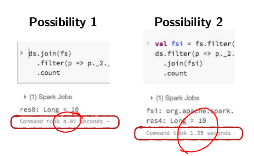
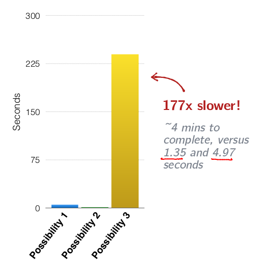
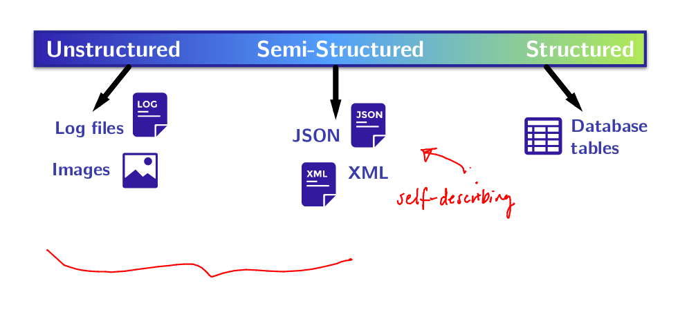
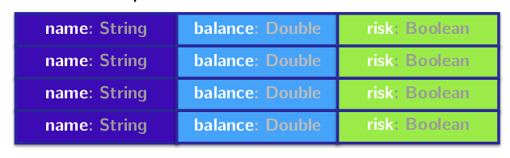
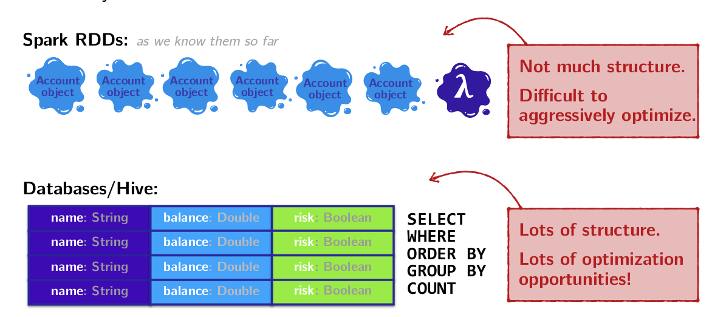

# Structured data: SQL, Dataframes, and Datasets

---

## Structured vs Unstructured Data

Let's imagine that we are an organisation, CodeAward, offering scholarships to programers who have overcome adversity. Let's say we have the following tow datasets.

```
case class Demographic(id:Int,
                      age:Int,
                      codingBootcamp:Boolean,
                      country:String,
                      gender:String,
                      isEthnicMinority:Boolean,
                      servedInMilitary:Boolean)

val demographics = sc.textfile(...)...// Pair RDD, (id, demographic)

case class Finances(id:Int,
                    hasDebt:Boolean,
                    hasFinancialDependents:Boolean,
                    hasStudentLoans:Boolean,
                    income:Int)

val finances = sc.textfile(...)...// Pair RDD, (id, finances)
```

Our data sets include students from many countries with many life and financial backgrounds. Now, let's imagine that our goal is to tally up and select for a specific scholarship.

As an example, Let's count:

* Swiss students
* Who have debt & financial has financial dependents
How might we implement this Spark program?

```
val demographics = sc.textFile(...) //Pair RDD, (id, demographic)
val finances = sc.textFile(...) // Pair RDD, (id, finances)
```

**Possibility 1**
```
demographics.join(finances)
  .filter {p => p_2._1.country == "Swiss" &&
    p_2._1.hasFinancialDependents &&
    p_2._1.hasDebt
  }.count()
```
**Possibility 2**
```
val filtered = finances.filter(p => p.hasFinancialDependents && p.hasDebt)

demographics.filter(_.counrty == "Switzerland")
  .join(filtered).count()
```
**Possibility 3**
```
val cartesian = demographics.cartesian(finances)

cartesian.filter {
  case(p1, p2) => p1._1 == p2._1
  }.filter {
    case(p1, p2) =>
    (p1._2.country == "Switzerland") &&
    (p2._2.hasFinancialDependents) &&
    (p2._2.hasDebt)
  }.count
```

Steps:

1. Cartesian product on both datasets (every combination demographics and finances)
2. Filter to select result of Cartesian with the same IDs (Inner join)
3. Filter to select people in Switzerland who have debt and financial dependents.

While for all three of these possible examples, the end result is the same, the time it takes to execute the job is vastly different.



So far, a recurring theme has been that we have have to think carefully about how our Spark jobs might actually be executed on the cluster in order to get good performance.

**Wouldn't it be nice if Spark automatically knew if we wrote the code in possibility 3, that it could rewrite our code to possibility 2?**
*Given a bit of extra structural information, Spark can do many optimisation for you.*

### Structured vs Unstructured Data

All data isn't equal. It falls on a spectrum from unstructured to structured.



### Structured Data vs RDDs

Spark + regular RDDs don't know anything about the schema of the data it's dealing with.

Given an arbitrary RDD, Spark knows that the RDD is parameterised with arbitrary types such as:

* Person
* Account
* Demographic

**but it doesn't know anything about these type's structure.**

Assuming we have a dataset of Account objects:
`case class Account(name: String, balance: Double, risk: Boolean)`

**Spark/RDDs see:**


> Blobs of objects we know nothing about except that they're called Account.
> Spark can't see inside this object or analyse how it may be used, and to optimise based on that usage. It's opaque

An example would be that Account could $N$ fields and only 3 are actually needed. Spark therefore can't optimise the data structure accordingly.

**A database/Hive sees:**



> Columns of named and typed values
> If spark could see data this way, it would break up and only select the datatypes it needs to send around the cluster.

**The same can be said about computation.**

**In Spark:**
* We do functional transformations on data.
* We pass user defined function literals to higher order functions like map, flatMap and filter.

> Like the data Spark operates on, function literals too are completely opaque to Spark.
> A user can do anything inside of one of these, and all Spark can see is something like: $anaon$1@345f4dg234

**In a database/Hive:**
* We de declarative transformations on data.
* Specialised / strucutred, predefined operations.

> Fixed set of operations, fixed set of types they operate on.
> Optimisations the norm!



RDDs operate on unstructured data, and there are few limits on computation; your computations are defined as functions that you've written yourself, on your own data types.

But as we saw, we have to do all the optimisation work ourselves!

**Wouldn't it be nice if Spark could do some of these optimisations for us?**

*Spark SQL makes this possible!*

> We've got to give up some of the freedom, felxibility, and generality of the functional collections API in order to give Spark more opportunities to optimise though.
