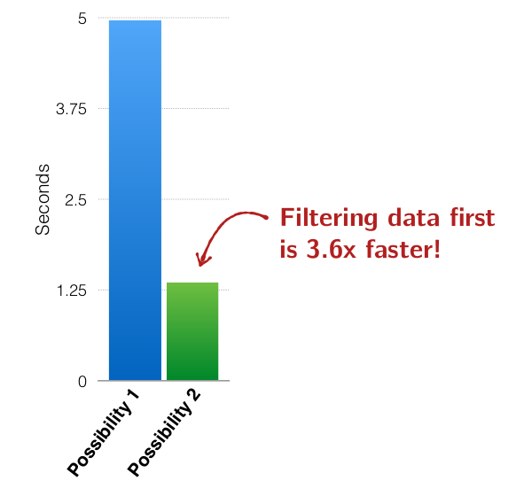

# Structured data: SQL, Dataframes, and Datasets

---

## Structured vs Unstructured Data

Let's imagine that we are an organisation, CodeAward, offering scholarships to programers who have overcome adversity. Let's say we have the following tow datasets.

```
case class Demographic(id:Int,
                      age:Int,
                      codingBootcamp:Boolean,
                      country:String,
                      gender:String,
                      isEthnicMinority:Boolean,
                      servedInMilitary:Boolean)

val demographics = sc.textfile(...)...// Pair RDD, (id, demographic)

case class Finances(id:Int,
                    hasDebt:Boolean,
                    hasFinancialDependents:Boolean,
                    hasStudentLoans:Boolean,
                    income:Int)

val finances = sc.textfile(...)...// Pair RDD, (id, finances)
```

Our data sets include students from many countries with many life and financial backgrounds. Now, let's imagine that our goal is to tally up and select for a specific scholarship.

As an example, Let's count:

* Swiss students
* Who have debt & financial has financial dependents
How might we implement this Spark program?

```
val demographics = sc.textFile(...) //Pair RDD, (id, demographic)
val finances = sc.textFile(...) // Pair RDD, (id, finances)
```

**Possibility 1**
```
demographics.join(finances)
  .filter {p => p_2._1.country == "Swiss" &&
    p_2._1.hasFinancialDependents &&
    p_2._1.hasDebt
  }.count()
```
**Possibility 2**
```
val filtered = finances.filter(p => p.hasFinancialDependents && p.hasDebt)

demographics.filter(_.counrty == "Switzerland")
  .join(filtered).count()
```
**Possibility 3**
```
val cartesian = demographics.cartesian(finances)

cartesian.filter {
  case(p1, p2) => p1._1 == p2._1
  }.filter {
    case(p1, p2) =>
    (p1._2.country == "Switzerland") &&
    (p2._2.hasFinancialDependents) &&
    (p2._2.hasDebt)
  }.count
```

Steps:

1. Cartesian product on both datasets (every combination demographics and finances)
2. Filter to select result of Cartesian with the same IDs (Inner join)
3. Filter to select people in Switzerland who have debt and financial dependents.

While for all three of these possible examples, the end result is the same, the time it takes to execute the job is vastly different.



So far, a recurring theme has been that we have have to think carefully about how our Spark jobs might actually be executed on the cluster in order to get good performance.

**Wouldn't it be nice if Spark automatically knew if we wrote the code in possibility 3, that it could rewrite our code to possibility 2?**
*Given a bit of extra structural information, Spark can do many optimisation for you.*

### Structured vs Unstructured Data

All data isn't equal. It falls on a spectrum from unstructured to structured.


### Structured Data vs RDDs

Spark + regular RDDs don't know anything about the schema of the data it's dealing with.

Given an arbitrary RDD, Spark knows that the RDD is parameterised with arbitrary types such as:

* Person
* Account
* Demographic

**but it doesn't know anything about these type's structure.**

Assuming we have a dataset of Account objects:
`case class Account(name: String, balance: Double, risk: Boolean)`

**Spark/RDDs see:**


> Blobs of objects we know nothing about except that they're called Account.
> Spark can't see inside this object or analyse how it may be used, and to optimise based on that usage. It's opaque

An example would be that Account could $N$ fields and only 3 are actually needed. Spark therefore can't optimise the data structure accordingly.

**A database/Hive sees:**


> Columns of named and typed values
> If spark could see data this way, it would break up and only select the datatypes it needs to send around the cluster.

**The same can be said about computation.**

**In Spark:**
* We do functional transformations on data.
* We pass user defined function literals to higher order functions like map, flatMap and filter.

> Like the data Spark operates on, function literals too are completely opaque to Spark.
> A user can do anything inside of one of these, and all Spark can see is something like: $anaon$1@345f4dg234

**In a database/Hive:**
* We de declarative transformations on data.
* Specialised / strucutred, predefined operations.

> Fixed set of operations, fixed set of types they operate on.
> Optimisations the norm!


RDDs operate on unstructured data, and there are few limits on computation; your computations are defined as functions that you've written yourself, on your own data types.

But as we saw, we have to do all the optimisation work ourselves!

**Wouldn't it be nice if Spark could do some of these optimisations for us?**

*Spark SQL makes this possible!*

> We've got to give up some of the freedom, felxibility, and generality of the functional collections API in order to give Spark more opportunities to optimise though.

---
## Spark SQL

> SQL is the lingua franca for doing analytics.

But it's a pain on the neck to connect big data processing pipelines like Spark or Hadoop to an SQL database.

**Wouldn't it be nice...**

* If it were possible to seamlessly intermix SQL queries with Scala?
* to get all the optimisations we're used to in the database community on Spark Jobs?

>Spark SQL gives us both!

### Spark SQL : Goals

Three main goals:

1. Support relational processing both within Spark programs (on RDDs) and on external data sources with a friendly APIs
> Sometimes it's more desirable to express a computation in SQL syntax than with functional APIs and vice a versa

2. High Performance, achieved by using techniques from research in databases.
3. Easily support new data sources such as semi-structured data (json) and external databases.

### Spark SQL
**Spark SQL is a component of the Spark stack**
* It is a Spark module for structured data processing
* It is implemented as a library on top of Spark.

 ***Three main APIs:***
 * SQL literal Syntax
 * Dataframes
 * Datasets

 ***Two specialized backend components:***
* **Catalyst**, query optimiser
* **Tungsten**, off-heap serialiser

**Spark SQL is a component of the Spark stack**
* It is a Spark module for structured data processing.
* It is implemented as a library on top of Spark.

**Visuall, Spark SQL related to the rest of Spark like this:**


### Relational Queries

Everything about SQL is structured.

In fact, SQL stands for structural query language.

* There are a set of fixed data types. Int, Long, String, etc.
* There are fixed set of operations. SELECT, WHERE, GROUP BY, etc.

Research and industry surrounding relational databases has focuses on exploiting this rigidness to get all kinds of performance speedups.

> Let's quick establish a common set of vocabulary and a baseline understanding of SQL.

### Spark Sql

**DataFrame** is SparkSql's core abstraction.

> Conceptually equivalent to a table in a relational database.

>DataFrames are, conceptually, RDDs full of records **with a known schema**

Unlike RDDs though, DataFrames **require** some kind of schema info!

DataFrames are **untyped!!!**

> That is, the Scala compiler doesn't check the types in its schema!

> DataFrames contain Rows which can contain any shcema.

Transformations on DataFrames are also known as **untyped transformations**

### SparkSession

To get stated using Spark SQL, everythin starts with SparkSession

```
import org.apache.sql.SparkSession

val spark = SparkSession
.builder()
.appName("My App")
//.config("spark.some.config", "some value")
.getOrCreate()
```

### Creating DataFrames

DataFrames can be created in 2 ways:

1. From existing RDDs.
> Either with schema inference, or with an explicit schema

2. Reading in a specific data source from file.
> Common structured or semi-structured formats such as json.

**(1a) Create DataFram from RDD, schema reflectively inferred**

Given a pair RDD, RDD[(T1, T", .., TN)], a DF can be created with its schema automatically inferred by simply using the `toDF` method.

```
val tupleRDD = ..

val tupleDF = tupleRDD.toDF("id", "name") //column names
```

If you already have an RDD containing some kind of case class instance, then spark can infer the attributes from the case class's fields.
```
case class Person(id:Int, name:String, city:String)
val peopleRDD = ...// Assume RDD[Person]
val peopleDF = peopleRDD.toDF
```

**(1b) Create DataFrame from existing RDD, schema explicitly specified**

Sometimes it's not possible to create a DataFrame with a predetermined case class as its schema. For these cases, it's possible to explicitly specify a schema.

It takes three steps:

* Create an RDD of Rows from the original RDD.
* Create the schema represented by a StructType matching structure of Rows in the RDD created in Step 1
* Apply the schema to the RDD of Rows via createDataFram method provided by SparkSession.

**(2) Creatae a DataFrame by reading in a data source from file.**
Using the SparkSession object, you can read in semi-structured / structured data by using the read method. For example, to read in data and infer a schema from a JSON file:

```
val df = spark.read.json("examples/src/main/resources/people.json")
```

### SQL Literals
Once you have a DataFrame to operate on, you cab now freely write familiar SQL syntax to operate on your dataset!

**Given**
A DataFrame called peopleDF, we just have to register our DataFrame as a temporary SQL view first:

```
peopleDF.createOrReplaceTempView("people")

val adultDF = spark.sql("Select * from people where age > 17")
```

The sql statements available to you are largely what's available in HiveQL. This includes standard SQL statements such as:

* Select
* From
* Where
* Count
* Having
* Group By
* Order By
* Sort by
* Distinct
* (Left|Right|Full) Outer Join
* Subqueries Select col from ( select a + b as col from t1) t2

[Supported SQL syntax](https://docs.datastax.com/en/datastax_enterprise/4.6/datastax_enterprise/spark/sparkSqlSupportedSyntax.html)

[Hive cheatsheet](https://hortonworks.com/blog/hive-cheat-sheet-for-sql-users/)

[Updated list of Spar SQL features](https://spark.apache.org/docs/latest/sql-programming-guide.html#supported-hive-features)

### A more interesting SQL Query

Let's assume we have a DataFrame representing a data set of eomployees:

```
case class Employee(id: Int, fname: String , lname: String, age: Int, city: String)

val employeeDF = sc.parallelize(..).toDF
```

Let's query this data set to obtain just the IDs and last names of employees working in a specific city, say, Sydney, Australia. Let's sort our result in order of increasing employee ID.

```
employeeDF.createOrReplaceTempView("employee")

val sydneyEmployeeDF = spark.sql("""
select id, lname
from employees
where city = "Sydney"
order by id
""")
```

---

## DataFrames

So far, we got an intuition of what DataFrames are, and we learned how to create them. We also saw that if we have a DataFrame, we use SQL syntax and do SQL queries  on them

**DataFrames have their own APIs as well!**

### DataFrames: In a Nutshell

DataFrames are...

**A relational API over Spark's RDDs**

**Able to be automatically aggressively optimised**

**Untpyed!!**

### DataFrames Data Types

To enable optimistions opportunities, Spark SQL's DataFrame operate on a restricted set of data types.


**Arrays**
> Array of only one type of element (elementType). containsNull is set to true if the elements in ArrayType value can have null values.

**Maps**
> Map of key/value pairs with two types of elements. valuecontainNull is set to true if the elements in MapType value can have null values

**Structs**
Struct type with list ofpossible fields of different types. containsNull is set to true if the elements in StructFields can have null values.


***Important .***

In order to access any of these data types, either basic or complex, you must first import Spark SQL types!

`import org.apache.spark.sql.types._`

###DataFrames Operations Are More Structured!

**When introduced, the DataFrame API introduced a number of relational operations**
> The main differnece between the RDD API and the DataFrames API was that DataFrame APIs accept Sppark SQL expressions, instead of arbitrary user-defined function literals like we were used to on RDDs. This allows the optimiser to understand what the computation represents, and for example with filter, it can often be used to skip reading unnecessary records.

**DataFrames API:** Si,ilar-looking to SQL. Example methods include:

* select
* where
* limit
* orderBy
* groupBy
* join

### Getting a look at your data

Before we get into transformations and actions on DataFrames, let's first look at the ways we can have a look at our data set.

**show()** pretty prints DataFrame in tabular form. Show first 20 elements.

**printSchema()** prints the schema of your DataFrame in a tree format.

Like on RDDs, transformations on DataFrames are (1) operations which return a DataFrame as a result, and (2) are lazily evaluated.

### Specifying Columns

As you might have observed, most methods take a paramenter of type Column or String, alwyas referring to some attribute/ column in the data set.

**Most methods on DataFrames tend to conform to some well-understood, pre-defined operation on a columns of the data set**

You can select and work with columns in 3 ways:
1. Using $-notation
`df.filter($"age" > 18)`

2. Referring to the DataFrame
`df.filter(df("age") > 18)`

3. Using SQL query string
1df.filter("age > 18")

**Example**

Recall the example SQL query that we did in the previous session on a data set of eomployees. Rather than using SQL syntax, let's convert our example to use the DataFrame API.

We'd like to obtain just the IDs and last names of employees working in a specific city, say Sydney, Australia. Let's sort our result in order of increasing employee ID.

```
val sydneyEmployeeDF = employeeDF
  .select($"id", $"lname")
  .where($"city" === "Sydney")
  .orderBy($"id")
```

### Filter in Spark SQL

The DataFrame API makes 2 methods available for filtering:
**filter** and **where**

Filters can be complex combinations:
`employeeDF.filter(($"age" > 25) && ($"city" === "Sydney")).show()`

### Grouping and Aggregating on DataFrames

One of the most common tasks on tables it (1) group data by a certain attribute, and then (2) do some kind of aggregation on it like a count.


**For grouping & aggregating, Spark SQL provides:**

* a groupBy function which reutnes a RelationalGroupDataset
* which has several standard aggregation functions defined on it like count, sum , max, min, and avg

**How to group and aggregate?**
* Just call groupBy on specific attribute / columns of a DataFrame,
* followed by a call to a method on RelationalGroupDataset like count, max, etc.

```
df.groupBy($"attribute1").agg(sum($"attribute2"))
df.groupBy($"attribute1").count($"attribute2")
```

**Example:**

Let's assume that we have a dataset of homes currently for sale in an entire US state. Let's calculate the most expensive, and least expensive home for sale per zip code.

```
case class Listing (street: String, zip: Int, price: Int)
val listingsDF = ... //Datafroma of listings
```
**How couldwe do this with DataFrames?**

```
val mostExpensiveDF = listingsDF.groupBy($"zip").agg(max($"price"))
val leastExpensiveDF = listingsDF.groupBy($"zip").agg(min($"price"))
```

**Example:**
Let's assume we have the following data set representing all of the posts in a busy open source community's Discourse forum.

```
case class Post(authorID: Int, subForum: String, likes: Int, date: String)

val postsDF = .. // DataFrame of Posts

```

Let's say we would like to tally up each authors' posts per subforum, and then rank the authors with the most posts per subForum
```
import or.apache.spark.sql.functions._

val rankedDF = postsDF
  .groupBy($"authorID", $"subForum")
  .agg(count($"authorId"))
  .orderBy($"subForum", $"count(authorID)".desc)
```


### Grouping and Aggregating on DataFrames

**After calling groupBy, methods on RelationalGroupDataset:**

To see a list of all operations you can call following a groupBy, see the [API docs](http: //spark.apache.org/docs/latest/api/scala/index.html#org.apache.spark.sql.RelationalGroupedDataset) for RelationalGroupDataset

**Methods within agg:**
Examples include: min, max, sum, mean, stddev, count, avg, first, last. To see a list of alloperations you can call within an agg, see the [API](http: //spark.apache.org/docs/latest/api/scala/index.html#org.apache.spark.sgl.functions) docs for org.apache.spark.sql.functions.

### Cleaning Data with DataFrames

Sometimes you may have a data et with null or NaN values. In these cases it's often desirable to do one of the following:

* drop rows / records with unwanted values like null or "NaN"
* replace certain values with a constant

**Dropping records with unwanted values:**

* drop() drop rows that contains null or Nan values in any column and returns a new DataFrame.
* drop("all") drops rows that contain null or NaN values in all columns.
* drop(Array("id", "name")) drops rows that contain null or NaN values in the specified columns and returns a new DataFrame.


**Repalcing unwanted values**

* fill(0) replace all occurrences of null or NaN in numeric columns with specified value and returns a new DataFrame.
* fill(Map("minBalance" -> 0)) replaces all occurrences of null or Nan in a specified value and returns a new DataFrame
* replace(Array("id"), Map(1234 -> 8921)) replaces specified value (1234) in specified column (id) with specified replacement value (8921) and returns a new DataFrame.

### Common Actions on DataFrames

Like RDDs, DataFrames also have their own set of actions.
> We've even used one several times already.

**collect(): Array[Row]**
Returns an array that contains all of Rows in this DataFrame.

**count(): Long**
Returns the first row in the DataFrame.

**show(): Unit**
Displays the top 20 rows of the DataFrame in a tabular form.

**take(n: Int): Array[Row]**
Returns the first n rows in the DataFrame.

### Joins on DataFrames

Joins on DataFrames are similar to those on PairRDDs, with one major usage difference that , since DataFrames aren't key/value pairs, we have to specify which columns we should join on.

**Several types of joins are available:**
inner, outer, left_outer, right_outer, leftsemi

**Performing joins:**
Given 2 DataFrames, df1, and df2 each with a column/attribute called id, we can perform an inner join as follows:

```
df1.join(df2, $"df1.id" === $"df2.id")
```

It's possible to change the join type by passing an additional string parameter to join specifying which type of join to perform. E.g.,

```
df1.join(df2, $"df1.id" === $"df2.id", "right_outer")
```

**Example:**

Recall our CFF data set from earlier in the course. Let's adapt it to the DataFrame APIs

```
case class Abo(id:Int, v: (String, String))
case class Loc(id: Int, v: String)

val as = ...
val abosDF = sc.parallelize(as).toDF

val ls = ...
val locationsDF = sc.parallelize(ls).toDF
```
**How do we combine only customers that have a subscription and where there is location info**
```
val trackedCustomersDF = abosDF.join(locationsDF, $"abosDF.id" === $"locationsDF.id", "inner")

```

**Example:** Let's assume the CFF wants to know for which subscribers the CFF has managed to collect location information. Which join do we use?  
```
val trackedCustomersDF = abosDF.join(locationsDF, $"abosDF.id" === $"locationsDF.id", "left_outer")

```

### Revisiting Our Selecting Scholarship Recpients Example

Now that we're familair with the DataFrame API, let's revisit the example that we looked at a few sessions back.

**Recall** Let's imagine that we are an organisation, CodeAward, offering scholarships to programmers who have overcome adversity. Let's say we have the following two datasetss.

```
case class Demographic(id: Int,
      age: Int,
      codingBootcamp: Boolean,
      country: String,
      gender: String,
      isEthnicMinority: Boolean,
      servedInMilitary: Boolean)
val demographicDF = sc.textFile(...).toDF

case class Finances(id: Int,
        hasDebt: Boolean,
        hasFinancialDependents: Boolean,
        hastStudentLoans: Boolean,
        income: Int)

val financesDF = sc.textfile(...).toDF
```

Our data sets include students from many countries, with many life and financial backgrounds. Now, let's imagine that our goal is to tally up and select students for a specific scholarship.

As an example, Let's count:

* Swiss students
* who have debt and financial dependents

**How might we implement this program with the DataFrame API?**

```
demographicDF.join(financesDF, demographicDF("id") == financesDF("id"), "inner")
  .filter(($"HasDebt") && ($"HasFinancialDependents") && $"Country" == "Switzerland")
  .count()
```

***Recall***

While for all three of these possible example, then end result is the same, the time it takes to execute the job is vastly different
* join -> filter -> count = 4.97 seconds
* filter -> filter -> join -> count = 1.35 seconds
* Cartesian join -> filter = 4 minutes
* dataframe solution = 1.24 seconds

### Optimisations

**How is that possible?**

Recall that Spark SQL comes with two specialised backend components:
* Catalyst, query optimizer
* Tungsten, off-heap serialiser

Let's briefly develop some intuition about why structured data and computations enable these two backend components do so many optimisations for you.

#### Catalyst
> Spark SQL's query optimiser
Recall our earlier map of how Spark SQL relates to the rest of Spark:


***Key thing to remember:***
**Catalyst compiles Spark SQL programs down to an RDD**


Assuming Catalyst...

* has full knowledge and understanding of all data types
* knows the exact schema of our data
* has detailed knowledge of the computations we'd like to do

**Makes it possible for us to do optimisations like**
* Reordering operations.
> Laziness + Structure gives us the ability to analyse and rearrange DAG of computations / the logical operations the user would like to do, before they're executed.

> E.g Catalyst can decide to rearrange and fuse together filter operations, pushing all filters as early as possible, so expensive operations later are done on less data.

* Reduce the amount of data we must read.

> Skip reading in, serialising and sending around parts of the data set that aren't needed for our computations.

* Prunning unneeded partitioning.

> Analyse DataFrame and filter operations to figure out and skip partitions that are unneeded in our computation.


#### Tungsten
> Spark SQL's off-heap data encoder.

Since our data types are restricted to Spark SQL data types, Tungsten can provide:

* highly specialised data encoders
* column-based
* off-heap (free from garbage collection overhead!!)

**Highly-specialised data encoders.**
> Tungsten can take schema information and tightly pack serialised data into memory. This means more data can fit in memory, and faster serialisation/de-serialisation (CPU bound tasks)

**Column-based**
> Based on the observation that most operations done on tables tend to be focused on specific columns/attributes of the data set. Thus, when storing data, group data by column instead of row for faster lookups of data associated with specific attributes/columns.
> Well know to be more efficient across DBMS

**Off-heap**
> Regions of memory off the heap, manually managed by Tungsten, so as to avoid garbage collection overhead and pauses.

Taken together, Catalyst and Tungsten offer ways to significantly speed up your code, even if you write it inefficiently initially.

### Limitations of DataFrames

#### Untyped
Your code compiles, but you get runtime exceptions when you attempt to run a query on a column that doesn't exist.

Would be nice if the was caught at compile time like we're used to in Scala!

#### Limited Data Types

If your data can't be expressed by `case/Products` and standard Spark SQL data types, it may be difficult to ensure that a Tungsten encoder exists for your data type.

E.g you have an application which already uses some kind of complicated regular Scala class.

#### Requires Semi-Structured/ Structured Data
If your unstructured data cannot be reformulated to adhere to some kind of schema, it would be better to use RDDs.

---

## Datasets

**DataFrames are actually Datasets**

`type DataFrame = Dataset[Row]`

**What is a dataset?**
* Datasets can be thought of as typed distributed collections of data.
* Dataset API unifies the DataFrame and RDD APIs. Mix and match!
* Datasets require structured/semi-structured data. Schemas and Encoders core part of Datasets.

**Thinks of Datasets as a compromise between RDDs & DataFrames.**
> You get more type information on Datasets than on DataFrames, and you get more optimizations on Datasets than you get on RDDs.

### Example

Let's calculate the average home price  per zipcode with Datasets. Assuming listingsDS is of type Dataset[Listing]:

```
listingsDS.groupByKey(l => l.zip) // looks like groupbyKey on RDDs!
    .agg(avg($"prove").as[Double]) // looks like or DataFrame operators!
```

We can freely mix APIs!

### Datasets

**Datasets are a something in the middle between DataFrames and RDDS**
* You can still use relational DataFrame operations as we learned in previous session on Datasets.
* Datasets add more typed operations that can be used as well.
* Datasets let you use higher-order functions like map, flatMap, filter again!!

Datasets can be used when you want a miix of functional and relational transformations while benfiting from some of the optimisations on DataFrames.

And we've almost got a type safe API as well.

### Creating Datasets
**From a DataFrame**
Just use the toDS convenience method.
`myDF.toDS // requires import spark.implicits._`

Note that often it's desirable to read in data from JSON from a file, which can be done with the read method on the SparkSession object like we saw in previous sessions, and then convert to a Dataset:
`val myDS = spark.read.json("people.json").as[Person]`

**From an RDD**
Just use the toDS convenience method.

`myRDD.toDS // requires import spark.implicits._`

**From common Scala types**
Just use the toDS conevience method.
`List("Yay", "ohnoes").toDS //requires import spark.implicits._`

### Typed Columns

Recall the column type from DataFrames. On Datasets, types operations tend to act on TypedColumn instead.

To create a TypedColumn, all you have to do is call as[...] on your (untyped) Column.

### Transformations on Datasets

Remeber untyped transformations from DataFrames?

The Dataset API includes both untyped and typed transformations.

* Untyped transformations the transformations we learned on DataFrames.
* typed transformations typed variants of many DataFrame transformations + additonal transformations such as RDD-like higher order functions map, flatMap, etc

**These APIS are intergrated.** You can call a map on a  DataFrame and get back a Dataset for example.
> Caveat: not every operation you know from RDDs are  available on Datasets, and not all operations look 100% the same on Datasets as they did on RDDs.

But remember, you may have to explicitly provide type information when going from a DataFrame to a Dataset via typed transformations.

### Common Typed Transformations on Datasets

**map**
**flatMap**
**filter**
**distinct**
**groupByKey**
**coalesce**
**repartition**


### Grouped Operations on Datasets

Like on DataFrames, Datasets have a special set of aggregation operations meant to be used after a call to groupByKey on a Dataset

* calling groupByKey on a Dataset returns a KeyValueGroupedDataset
* KeyValueGroupedDataset contains a number of aggregation operations which return  Datasets

**How to group & aggregate on Datasets?**

1. Call groupByKey on a Dataset, get back a KeyValueGroupedDataset.
2. Use an aggregation operation on KeyValueGroupedDataset (return Datasets)

> Note: using groupBy on a Dataset, you will get back a RelationalGroupDataset whose aggregation operators will return a DataFrame. Therefore, be careful to avoid groupBy if you would like to stay in the Dataset API.

### Some KeyValueGroupedDataset Aggregation Operations

**reduceGroups** reduceGroups(f: (V,V) => V): Dataset[(K, V)]
> Reduces the elements of each group of data using the specified binary function. The given function must be commutative and associative or the result may be non-deterministic.

**agg** agg[U](col: TypedColumn[V, U]): DataSet[(K, U)]
> Computes the given aggregation, returning a Dataset of tuples for each unique key and the result of computing this aggregation over all elements in the group.

#### Using the General agg Operation

Just like on DataFrames, there exists a general aggregation operation agg defined on KeyValueGroupedDataset.

`agg[U](col: TypedColumn[V, U]): Dataset[(K,U)]`

**The only thing a bit peculiar about this operation is its argument. What do we pass to it?**

An aggregation function

Typically, we simply select one of these operations from function, such as avg, choose a column for avg to be computed on, and we pass it to agg.

`someDS.agg(avg($"column").as[Double])`

**mapGroups** mapGroup[U](f: (K, Iterator[V]) => U): Dataset[U]
> Applies the given function to each group of data. For each unique group, the function will be passed the group key and an iterator that contains all of the elements in the group. The function can return an element of arbitrary type which will be returned as a new Dataset.

**flatMapGroups** flatMapGroups[U](f: (K, Iterartor[V]) => TraversableOnce[U]): Dataset[U]
> Applies the given function to each group of data. For each unique group, the function will be passed the group key and an iterator that contains all of the elements in the group. The function can return an iterator containing elements of an arbitrary type which will be returned as a new Dataset.

#### reduceByKey?

If you glance around the Dataset API docs, you might notice that Datasets are missing an important transformation that we often used on RDDS: reduceByKey/

**Challenge:**

Emulate the semantics of reduceByKey on a Dataset using Dataset operations presented so far. Assume we'd have the following data set:
```
val keyValues =
List((3, "Me"), (1, "Thi"))
```

Find a way to use Datasets to achieve the same result that you would get if you put this data into an RDD and caleed:

`keyValuesRDD.reduceByKey(_ + _)`

```
val keyValuesDS = keyValues.toDS
keyValuesDS.groupByKey(p => p._1)
  .mapGroups((k, vs) => (k, vs.foldLeft("")((acc, p) => acc + p._2)))
  .sort($"_1")
  .show()
```

**The only issue with this approach is this disclaimer in the API for mapGroups:**
> This function does not support partial aggregation, and as a result shuffling all the data in the dataset. If an application intends to perform an aggregation over each key, it is best to use the *reduce* function or an org.apache.spark.sql.expression#Aggregator


### Aggregators

A class that helps you generically aggregate data. Kind of like the aggregate method we saw on RDDs.

`class Aggregator[-IN, BUF, OUT]`

* IN is the input type to the aggregator. When using aggregator after groupByKey, this is the type that represents the value in the key/value pair.
* BUF is the intermediate type during the aggregation.
* OUT is the type of the output of the aggregation.

**This is how to implement our own Aggregator:**
```
val myAgg = new Aggregator[In. BUF, OUT] {
  def zero: BUF = ... //The initial value
  def reduce(b: BUF, a: IN): BUF = ... // Add an element to the running total
  def merge (b1: BUF, b2: BUF): BUF = ... // Merge intermediate values
  def finish(r: BUF): OUT = ... // Return the final result
}/toColumn
```

#### Emulating reduceByKey with an Aggregator

Let's return to our example of trying to emulate reduceByKey on a specific data set, and let's see if we can implement the aggregation part of our reduceByKey

```
val strConcat = new Aggregator[(Int, String), String, String] {
  def zero: String = ""
  def reduce(b: String, a: (Int, String)): String = b + a._2
  def merge(b1: String, b2: String): String = b1 + b2
  def finish(r: String): String = r
}.toColumn

keyValuesDS.groupByKey(pair => pair._1).agg(strConcat.as[String]) // We're missing an encoder
```

#### Encoders

Encoders are what convert your data between JVM objects and Spark SQL's specialised internal (tabular) representation. **They're required by all Datasets!**

Encoders are highly specialised, optimised code generators that generate custom bytecode for serialisation and de-serialisation of your data.

The serialised data is stored using Spark internal Tungsten binary format, allowing for operations on serialised data and improved memory utilisation.

**What sets them apart from regular Java or Kryo serialisation:***
* Limited to and optimal for primitives and case classes, Spark SQL data type, which are well understood.
* **They contain schema information,** which makes these highly optimised code generators possible, and enables optimisation based on the shape of the data. Since Spark understands the structure of the data in Datasets, it can create a more optimal layout in memory when caching Datasets.
* Uses significantly less memory than Kyro/Java serialisation
* > 10 x faster than Kyro serialisation (Java serialisation orders of magnitude slower)

**Two ways to introduce encoders:**
* Automatically (generally the case) via implicits from a SparkSession. import.spark.implicits._
* Explicit via org.apache.spark.sql.Encoder which contains a large selection of method for creating Encoders from Scala primitive types and Products


**Some example of Encoder creation methods in Encoders**
* INT/LONG/STRING etc, for nullable primitives
* scalaInt/scalaLong/scalaByte etch, for Scala's primitives.
* product/tuple for Scala's product and tuple types.

Example: Explicitly creating Encoders.
Encoders.scalaInt // Encoder[Int]
Encoders.STRING // Encoder[String]
Encoders.product[Person] // Encoder[Person], where Person extends Product / is a case class

```
val strConcat = new Aggregator[(Int, String), String, String] {
  def zero: String = ""
  def reduce(b: String, a: (Int, String)): String = b + a._2
  def merge(b1: String, b2: String): String = b1 + b2
  def finish(r: String): String = r
  override def bufferEncoder: Encoder[BUF] = Encoders.STRING
  override def outputEncoder: Encoder[BUF] = Encoders.STRING
}.toColumn

keyValuesDS.groupByKey(pair => pair._1).agg(strConcat.as[String]) // We're missing an encoder
```

### When to use Datasets vs DataFrames vs RDDs?
**Use Dataset when...**
* you have structured/semi-structured data
* you want typesafety
* you need to work with functional APIs
* you need good performance, but it doesn't have to be the best

**Use DataFrames when...**
* you have structured/semi-structured data
* you want the best possible performance, automatically optimised for you

**Use RDDs when...**
* you have unstructured data
* you need to fine-tune and manage low-level details of RDD computations
* you have complex data types that cannot be serialised with Encoders


### Limitations of Datasets

#### Catayst Can't Optimise All Operations

Take filtering as an example.

**Relational filter operation** EG. ds.filter($"city".as[String] === "Boston").
Performs best because you're explicitly telling Spark which columns/attributes and conditions are required in your filter operation. With information about the structure of the data and the structure of computations. Spark's optimiser knows it can access only the fields involved in the work filter without having to instantiate the entire data type. Avoids data moving over the network.
***Catalyst optimises this case***

**Functional filter operation** E.g ds.filter(p => p.city == "Boston").
Same filter written with a function literal is opaque to Spark - it's impossible for Spark to introscpect the lambda function. All Spark knows is that you need a (whole) record marshalled as a Scala object in order to return true or false, requiring Spark to do potentially a lot more work to meet that implicit requirement.
***Catalyst cannot optimise this case.***

###### Takeaways

* When using Datasets with higher-order functions like map, you miss out on may Catalyst optimisations.
* When using Datasets with relational operations like select, you get all of Catalyst's optimisations.
* Though not all operations on Datasets benefit from Catayst's optimisations, Tungseten is still always running under the hood of Datasets, storing and organising data in a highly optimised way, which can result in large speedups over RDDs

####### Limited Data Types

If your data ca't be expressed by case classes/Product and standard Spark SQL data types, it may be difficult to ensure that a Tungsten encoder exists for you data type.

E.g you have an application which already uses some kind of complicated regular Scala class.

If your unstructured data cannot be reformulated to adhere to some kind of schema, it would be better to use RDDs.
