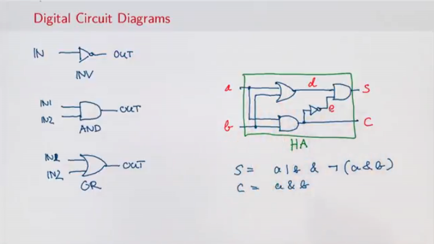
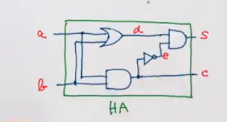
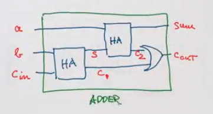

# Functions and State

Principles of Reactive Programming
---

Until now our programs our programs have been side effect free. Therefore, the concept of _time_ wasn't important.
For all programs that terminate, any sequence of actions would have given the same results.
This was also reflected in the substitution model of computations.

 Programs can be evalutated by rewriting.
The most important rewrite rule covers function applications:
```
def f(x1,..., xn) = B;, ... f(v1,...,vn)
def f(x1, ..., xn) =B; ... [v1/x1, ..., vn/xn]B
```

### Stateful objects

In proactive, objects with state are usually represented by objects that have some variable members.

**Example**: here is a class modeling a bank account.
```
class BankAccount {
  private var balance = 0
  def deposite(amount: Int): Unit = {
    if (amount > 0) balance = balance + amount
  }

  def withdraw(amount: int): Int =
    if (0 < amount && amount <= balance) {
      balance - balance - amount
      balance
    } else throw new Error("Insufficient Funds")
}
```

The class `BankAccount` defines a variable `balance` that contains the current balance of the account.

The methods `deposit` and `withdraw` change the value of the `balance` through assignments.

Note that balance is private in the BankAccount class, it therefore cannot be accessed from outside the class.

To create bank accounts, we use the usual notation for object creation.


A `var` does not necessarily make an object Stateful.

---

# Identity & Change

Assignment poses the new problem of deciding whether two expressions are the same.

When one excludes assignments and one writes:
`val x = E; val y = E`

where `E` is an arbitrary expression, then it is reasonable to assume that `x` and `y` are the same. That is to say that we could have also written:

`val z = E; val y = x`
(This property is usually call **referential transparency**)


### Operation Equivalence

To deal with questions where referential transparency is not clear. We must specify what is meant by "the same".

The precise meaning of "being the sane" is defined by the property of **operations equivalence**.

In a somewhat informal way, this property states as follows.

Suppose we have 2 different definitions x and y.

x and y are operationally equivalent if no possible test can distinguish between them.

To test if `x` and `y` are the same, we must
* Execute the definitions followed by an arbitrary sequence `f` of operations that involves `x` an `y`, observing the possible outcomes.

```
val x = new BankAccount   val x = new BankAccount
val y = new BankAccount   val y = new BankAccount
f(x,y)                    f(x,x)
```

* Then, execute the definitions with another sequence `S'` obtained by renaming all occurrences of `y` by `x` in `S`.
* If the results are different, then the expressions `x` and `y` are certainly different.
* On the other hand, if all possible pairs of sequences `(S, S')` produce the same result, then `x` and `y` are the same.

### Assignment and Substitution Model

With the use of assignments the model of computation by substitution cannot be used.

Indeed, according to this model, one can always replace the name of a value by the expression that defines it. For example, in

```
val x = new BankAccount
val y = x
```

the `x` in the definition of `y` could be replaced by `new BankAccount`.

---

## Loops

**Proposition:** Variables are enough to model all imperative programs.

But what about control statements like loops?

We can model them using functions.

### While and Repeat

**Example:** Here is a Scala program that uses a while loop:

```
def power(x: Double, exp: Int): Double = {
  var r = 1.0
  var i = exp
  while (i > 0) {r =r * x; i = i - 1}
  r
}

```

In Scala, `while` is a keyword.
But how could we define while using a function (call it WHILE)?

```
def WHILE(condition: => Boolean)(command: => Unit): Unit  =
  if(condition) {
    command
    WHILE(condition)(command)
  }
  else ()
```

**Note**: The condition and the command must be passed by name so that they're revaluated in each iteration.
**Note**: WHILE is tail recursive, so it can operate with a constant stack size.

Write a function implementing a `repeat` loop that is used as follows:

```
REPEAT {
  command
} (condition)
```

It should execute command one or more times, until `condition` is true.

```
def REPEAT(command\: => Unit)(condition: => Boolean): Unit = {
  command
  if(condition) () else REPEAT(command)(condition)
}
```

### For Loops

The classical `for` loop in Java can not be modeled simply by a higher-order function.

The reasosn is that in a Java program like

```
for( int i = 1; i < 3; i = i + 1){ System.out.println(i + " ")}
```
the arguments of for contain the **declaration** of the variable i, which is visible in other arguments and in the body.

However, in Scala  there is a kind of for loop similar to Java's extended for loop:
```
for( i< 1 unitl 3) {System.out.println(i + " ")}
```

### Translation of For-Loops

For-Loops translate similarly to for-expressions, but using the foreach combinator instead of `map` or `flatMap`.

`foreach` is defined on collections with elements of type T as follows

```
def foreach(f: T => Unit): Unit =
  // apply f to each element of the collection

```
**Example:**¬
```
for(i <- 1 until 3; j <- "abc") println(i + " " + j)
```
translates to:
```
(1 until 3) foreach (i => "abc" foreach (j => println(i + " " + j)))
```

---

## Discrete Event Simulation

Here's an example that shows how assignments and higher-order functions can be combined in interesting ways.

We will construct a digital circuit simulator.

The simulator is based on a general framework for discrete event simulation.

Let's start with a small description language for digital circuits.

A digital circuit is composed of wires and of functional components.

Wires transport signals that are transformed by components.

We represent signals that are transformed by components.

We represent signals using booleans true and false.

The base components (gates)  are:
* The *Inventor*, whose output is the inverse of its input.
* The *AND gate*, whose output is the conjunction of its inputs.
* The *OR gate*, whose output is the disjunction of its inputs.

Other components can be constructed by combining these base components.

The components have a reaction time (or *delay*), i.e their outputs don't change immediately after a change to their inputs.




### A language for Digital Circuits

We describe the elements of a digital circuit using the following Scala classes and functions.

To start with, the class Wire models wires.

Wires can be constructed as follows:
```
val a = new Wire; val b = new Wire; val c = new Wire

```

Or, equivalently
```
val a, b, c = new Wire
```

Then, there are the following functions. Each has a side effect that creates a gate
```
def inverter(input: Wire, output: Wire): Unit
def andGate(a1: Wire, a2: Wire, output: Wire): Unit
def orGate(o1: Wire, o2: Wire, output: Wire): Unit
```

More complex components can be constructed from these.

For example, a half-adder  can be defined as follows:

```
def halfAdder(a: Wire, b: Wire, s:Wire, c: Wire): Unit = {
  val d, e = new Wire
  orGate(a, b , d)
  andGate(a, b, c)
  inverter(c, e)
  andGate(d, e, s)
}
```


The half-adder can in turn be used to define a full adder:
```
def fullAdder(a:Wire, b:Wire, cin: Wire, sim: Wire, cout: Wire): Unit ={
  val s, c1, c2 = new Wire
  halfAdder(b, cin. s, c1)
  halfAdder(a, s, sum, c2)
  orGate(c1, c2, cout)
}
```




What logical function does this program  describe?

```
def f(a: Wire, b: Wire, c: Wire): Unit = {
  val d, e, f, g = new Wires
  inverter(a, d)
  inverter(b, e)
  andGate(a, e, f)
  andGate(b, d, g)
  orGate(f, g, c)
}
```

`a != b` The Not Adder

---

## Discrete Event Simulation: API ad Usage

The class Wire and the functions inverter, and Gate and orGate represent a small description language of digital circuits.

We now give the implementation of this class and its functions which allow us to simulate circuits.

These implementations are based on a simple API for discrete event simulation.

A discrete event simulator performs actions, specified by the user at a given moment.

An action is a function that doesn't take any parameters and which returns Unit:

```
type Action = () => Unit
```

The time is simulated; it has nothing to do with the actual time.

A concrete simulation happens inside an object that inheirts from the trait Simulation, which has the following signature:

```
trait Simulation {
  def currentTime: Int = ???
  def afterDelay(delay: Int)(block: => Unit): Unit = ???
  def run(): Unit = ???
}
```
Here,

currentTime returns the current simulated time in the form of an integer.

afterDelay registers an action to perform after a certain delay (relative to the current time, currentTime)

run performs the simulation until there are no more actions waiting.

### Class Diagram


### The wire class

A wire must support three basic operations:

getSignal: Boolean
  Returns the current value of the signal transported by the wire.

setSeginal(sig: Boolean): Unit
  Modifies the value of the signal transported by the wire.

addaction(a: Action): unit
  Attaches the specific procedure to the actions of the wire. All of the attached actions are executed at each change of the transported signal.

### Implementing Wires
Here's an implementation of the class Wire:
```
class Wire {
  private var sigval = false
  private var actions: List[Action] = List()
  def getSignal: Boolean = sigVal
  def setSignal(s: Boolean): Unit =
    if(s != sigVal){
      sigVal = s
      actions foreach (_())
    }
    def addAction(a: Action): Unit = {
      actions = a :: actions
      a()
    }
}
```

The state of the wire is modelled by tow variables:
* sigVal represents the current value of the signal.
* actions represents the actions currently attached to the wire.

### The inverter
We implement the inverter by installing an action on its input wire.

This action produces the inverse of the input signal on the output wire.

The change must be effective after a delay of InverterDelay units of simulated time.

```
def inverter(inputL Wire, output: Wire): Unit = {
  def invertAction(): Unit = {
    val inputSig = input.getSignal
    afterDelay(InvertDelay) { output setSignal !inputSig}
  }

  input addAction invertAction
}
```

### The AND Gate

The AND gate is implemented in a similar way.

The action of an AND gate produces the conjunction of input signals on the output wire.

This happens after a delay of AndGateDelay units of simulated time.

```
def andGate(in1: Wire, in2: Wire, output: Wire): Wire = {
  def andAction(): Unit = {
    val in1Sig = in1.getSignal
    val in2Sig = in2Sig.getSignal
    afterDelay(AndGateDelay){ output setSignal (in1Sig & in2Sig)}
  }
  in1 addAction andAction
  in2 addAction andAction
}
```

### THe Or gate

The OR gate is implemented analogously to the AND gate.

```
def orGate(in1: Wire, in2: Wire, output: Wire): Wire = {
  def orAction(): Unit = {
    val in1Sig = in1.getSignal
    val in2Sig = in2Sig.getSignal
    afterDelay(AndGateDelay){ output setSignal (in1Sig | in2Sig)}
  }
  in1 addAction orAction
  in2 addAction orAction
}
```

---
## Discrete Event Simulation

### The simulation trait
All we have left to do now is to implement the Simulation trait.

The idea is to keep in every instance of the simulation trait an agenda of actions to perform.
The agenda is a list of simulated events. Each event consists of an action and the time when it must be produced.

The agenda list is sorted in such a way that the actions to be performed first are in the beginning.

```
trait Simulation {
  type Action = () => Unit
  case class Event(time: Int, action: Action)
  private type Agenda = List[Event]
  private var agenda: Agenda = List()
}
```

### Handle Time

There is also a private variable, curtime, that contains the current simulation time:
`private var curtime = 0`

It can be accessed with a getter function currentTime:

`def currentTime: Int = curTime`

An application of the afterDelay(delay)(block) method inserts the task
`Event(curtime + delay, () => block)`

into the agenda list at the right position.

```
def afterDelay(delay: Int)(block: => Unit): Unit = {
  val item = Event(currentTime + delay, () => block)
  agenda = insert(agenda, item)
}
```
The insert function is straightforward:
```
private def insert(ag: List[Event], item: Event): List[Event] = ag match {
  case first :: rest if first.time <= item.time =>
    first :: insert(rest, item)
  case _ =>
    item :: ag
}
```
